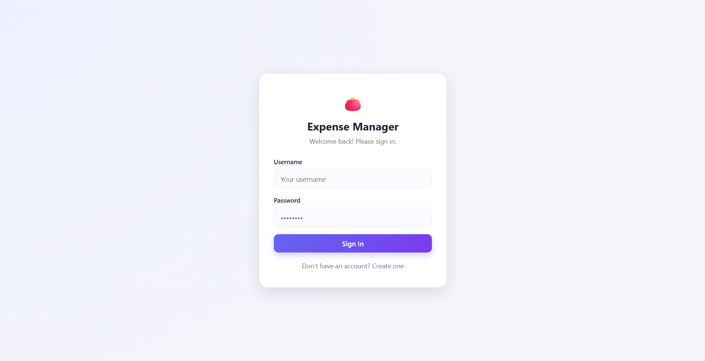
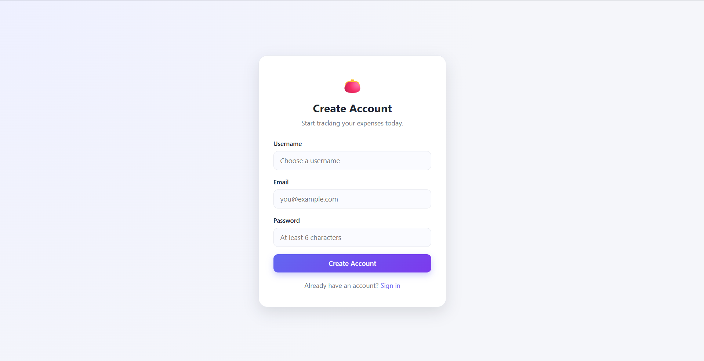
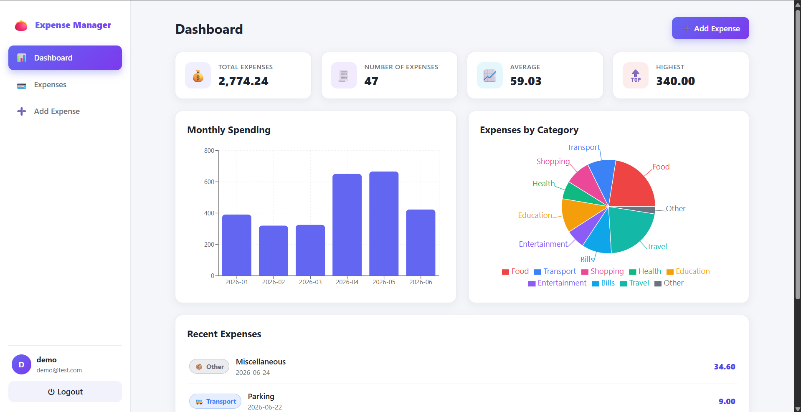
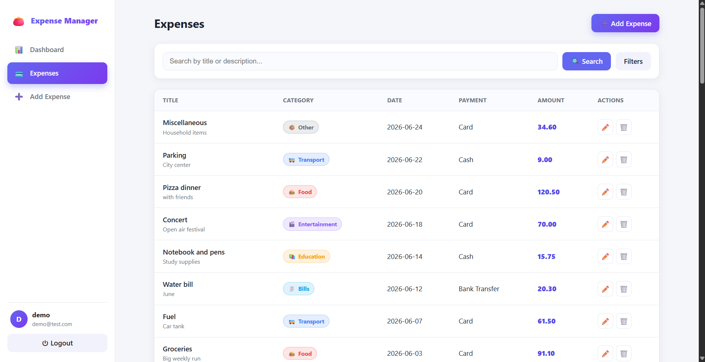
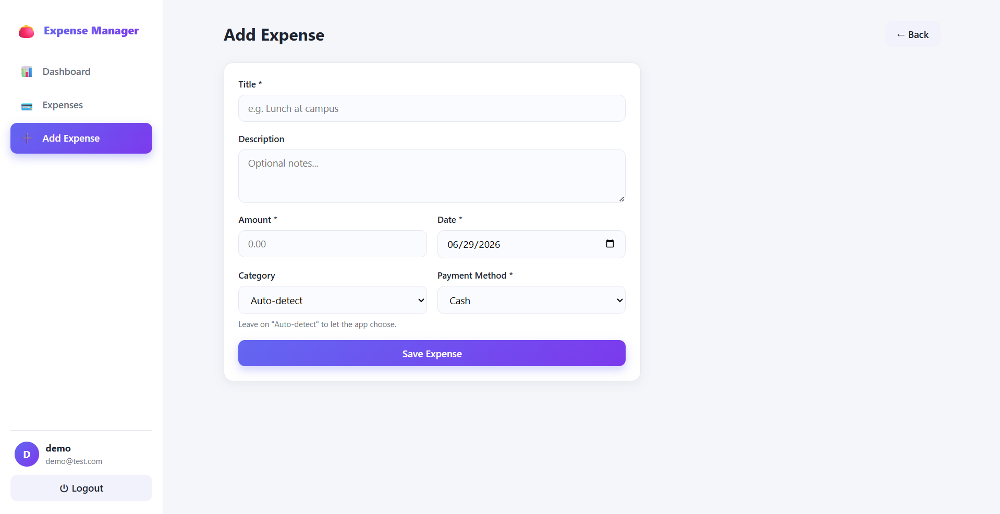
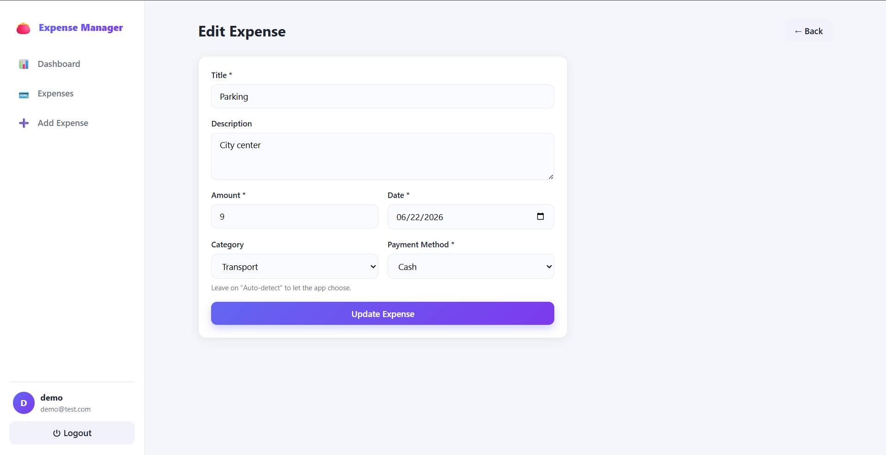
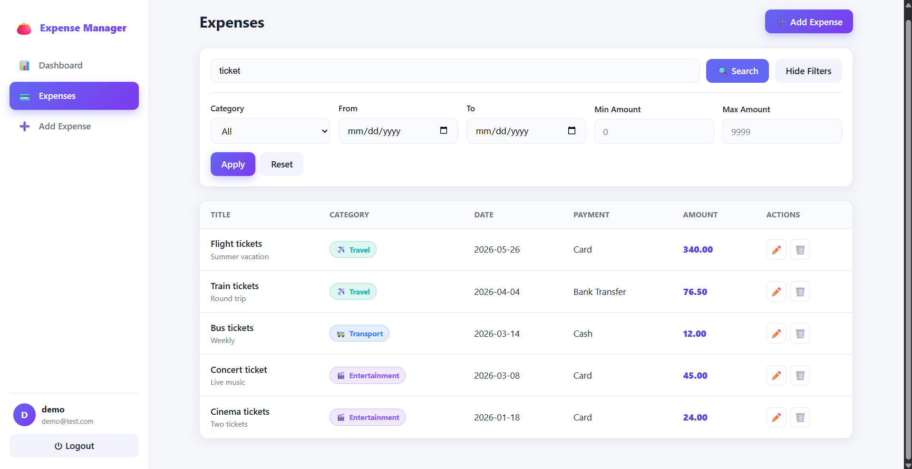

# Gestion de dépenses personnelles (Personal Expense Manager)

A simple full-stack web application to **track, manage and analyze personal expenses**.
Built as a university end-of-module project: the code is intentionally kept simple,
layered and easy to explain.

---

## Table of Contents

- [Description](#description)
- [🎥 Demo video](#-demo-video)
- [Technologies used](#technologies-used)
- [Project structure](#project-structure)
- [Run with Docker (recommended)](#run-with-docker-recommended)
- [Run manually (without Docker)](#run-manually-without-docker)
- [Authentication](#authentication)
- [API endpoints](#api-endpoints)
- [Features](#features)
- [Screenshots](#screenshots)
- [Report](#report)

---

## Description

The app lets a user register/login and then add, edit, delete, search, filter and
analyze expenses through a clean dashboard with charts. It also performs **automatic
keyword-based categorization** of expenses.

---

## 🎥 Demo video

A short demo of the running application is available here:

**▶️ [Watch the demo](https://drive.google.com/file/d/1kvylsc0pHs-LepqyuwWQkFDRobHF4kpS/view?usp=sharing)**

What the video walks through:

1. **Login** — signing in with an existing account (JWT authentication).
2. **Dashboard** — the summary cards (total, count, average, highest expense) and the
   charts (monthly spending bar chart + expenses-by-category pie chart).
3. **Add an expense** — creating an expense (e.g. *"Pizza"*) **without choosing a
   category**, and seeing it get **automatically categorized** (→ FOOD).
4. **Expense list** — browsing all expenses with category badges and highlighted amounts.
5. **Search** — searching expenses by keyword (title / description).
6. **Filter** — filtering by category, date range and amount range.
7. **Updated statistics** — going back to the dashboard to see the charts and totals refresh.

---

## Technologies used

**Backend**
- Java 17
- Spring Boot **3.5.16** (Web, Data JPA, Validation, Security)
- JWT authentication (JJWT)
- MySQL
- Maven

**Frontend**
- React + Vite (JavaScript)
- React Router
- Axios
- Recharts (charts)
- Plain CSS

**Infrastructure**
- Docker & Docker Compose (backend, frontend, mysql)

---

## Project structure

```
.
├── docker-compose.yml
├── README.md
├── rapport.tex                  # LaTeX report (French)
├── expense-tracker-backend/     # Spring Boot API
│   ├── pom.xml
│   ├── Dockerfile
│   └── src/main/java/com/example/expensetracker/
│       ├── entity/  enums/  repository/  service/
│       ├── controller/  dto/  exception/  security/
│       └── ExpenseTrackerApplication.java
└── expense-tracker-frontend/    # React app
    ├── package.json
    ├── Dockerfile
    └── src/  (api, auth, components, pages, routes, styles)
```

---

## Run with Docker (recommended)

Requires Docker + Docker Compose.

```bash
docker compose up --build
```

Then open:
- Frontend: http://localhost:5284
- Backend API: http://localhost:9097
- MySQL: localhost:3306 (user `root`, no password, db `expense_db`)

Stop everything:

```bash
docker compose down          # keep data
docker compose down -v       # also delete the database volume
```

---

## Run manually (without Docker)

### 1. Database
Start a MySQL server and create the database (or let the app create it):

```sql
CREATE DATABASE IF NOT EXISTS expense_db;
```

If your MySQL listens on the default port **3306**, update
`expense-tracker-backend/src/main/resources/application.properties`:

```properties
spring.datasource.url=jdbc:mysql://localhost:3306/expense_db?createDatabaseIfNotExist=true
```

### 2. Backend
```bash
cd expense-tracker-backend
mvn spring-boot:run
# API available on http://localhost:9097
```

### 3. Frontend
```bash
cd expense-tracker-frontend
cp .env.example .env          # VITE_API_URL=http://localhost:9097/api
npm install
npm run dev
# App available on http://localhost:5284
```

---

## Authentication

Authentication uses **Spring Security + JWT**, kept deliberately simple:

1. **Register** (`POST /api/auth/register`): the password is hashed with **BCrypt**
   and stored; a JWT is returned.
2. **Login** (`POST /api/auth/login`): credentials are verified, a JWT is returned.
3. The frontend stores the token in `localStorage` and sends it on every request as
   `Authorization: Bearer <token>`.
4. A `JwtAuthFilter` validates the token on each request and sets the authenticated user.
5. Only `/api/auth/**` is public; **all other endpoints require a valid token**.

Each expense belongs to a user, so a user only ever sees their own data.

---

## API endpoints

### Auth (public)
| Method | Path                | Body                          | Returns          |
|--------|---------------------|-------------------------------|------------------|
| POST   | /api/auth/register  | `{username, email, password}` | `{token, username, email}` |
| POST   | /api/auth/login     | `{username, password}`        | `{token, username, email}` |

### Expenses (protected)
| Method | Path                                                                     |
|--------|--------------------------------------------------------------------------|
| GET    | /api/expenses                                                            |
| GET    | /api/expenses/{id}                                                       |
| POST   | /api/expenses                                                            |
| PUT    | /api/expenses/{id}                                                       |
| DELETE | /api/expenses/{id}                                                       |
| GET    | /api/expenses/search?keyword=                                            |
| GET    | /api/expenses/filter?category=&startDate=&endDate=&minAmount=&maxAmount= |

### Dashboard (protected)
| Method | Path                      | Description                         |
|--------|---------------------------|-------------------------------------|
| GET    | /api/dashboard/summary    | total, count, average, highest      |
| GET    | /api/dashboard/monthly    | spending grouped by month           |
| GET    | /api/dashboard/categories | totals grouped by category          |
| GET    | /api/dashboard/recent     | 5 most recent expenses              |

**Expense fields:** `id, title, description, amount, date, category, paymentMethod, createdAt, updatedAt`
**Categories:** FOOD, TRANSPORT, SHOPPING, HEALTH, EDUCATION, ENTERTAINMENT, BILLS, TRAVEL, OTHER
**Payment methods:** CASH, CARD, BANK_TRANSFER, OTHER

> When `category` is omitted on create/update, the backend auto-detects it from the
> title/description keywords (e.g. *pizza* → FOOD, *taxi* → TRANSPORT).

---

## Features

- 🔐 Register / Login with JWT
- 📊 Dashboard: total, count, average, highest, monthly bar chart, category pie chart, recent list
- 🧾 Expense CRUD (add / edit / delete / list)
- 🔎 Search by title or description
- 🎚️ Filter by category, date range and amount range
- 🤖 Automatic keyword-based categorization
- 📱 Responsive, modern UI

---

## Screenshots

### Authentication

| Login | Register |
|:-----:|:--------:|
|  |  |

### Dashboard

<p align="center">
  
</p>

### Expense management

| Expense list | Add expense |
|:------------:|:-----------:|
|  |  |

| Edit expense | Search &amp; filter |
|:------------:|:-------------------:|
|  |  |
